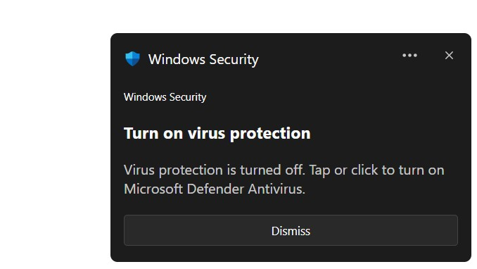

# Windows 11 defender disable notification in html/css/js
Yes it on web. it on a simple html, css, js codes without Node.js.
It can make fake Windows 11 notification that say windows defender is turn off.

You can open script.js file and see function (they are not difficult).
`fireNoti()` is for show notification

In `doTrgt()` you can do anything you want do when user click on the notification (for turn on defender :) )

If you use it for your projects, don't forget to give me the credits. (: 😄 

**This is only for fun and prank, DONT USE IT FOR ILLEGAL WORKS**

Please dont use this for scams like phishing or ... . I am not responsible for this.